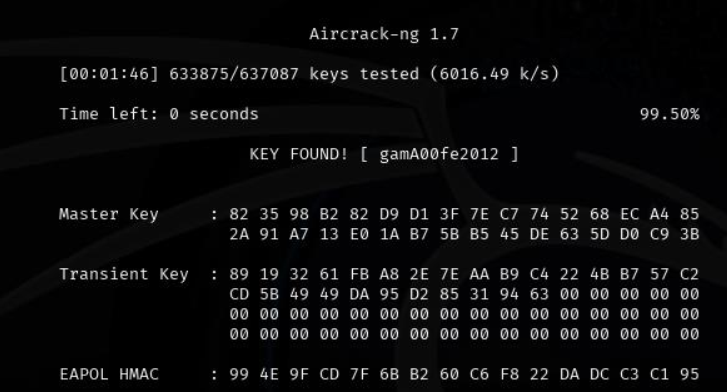
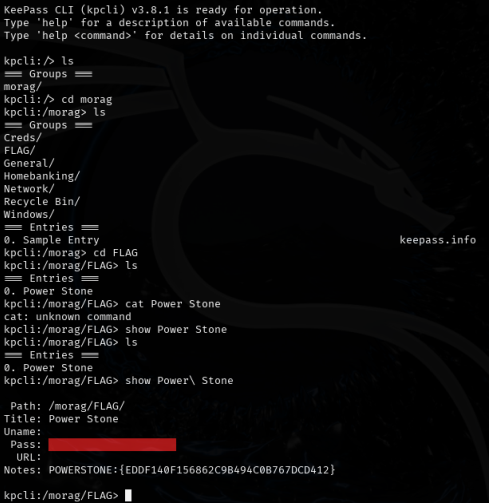
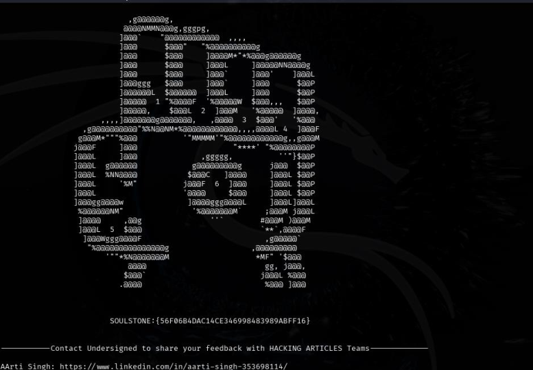

```text
██╗███╗   ██╗███████╗██╗███╗   ██╗██╗████████╗██╗   ██╗
██║████╗  ██║██╔════╝██║████╗  ██║██║╚══██╔══╝╚██╗ ██╔╝
██║██╔██╗ ██║█████╗  ██║██╔██╗ ██║██║   ██║    ╚████╔╝
██║██║╚██╗██║██╔══╝  ██║██║╚██╗██║██║   ██║     ╚██╔╝  
██║██║ ╚████║██║     ██║██║ ╚████║██║   ██║      ██║   
╚═╝╚═╝  ╚═══╝╚═╝     ╚═╝╚═╝  ╚═══╝╚═╝   ╚═╝      ╚═╝   
```


---

## 🧠 Machine Information

| Item        | Value                            |
| ----------- | -------------------------------- |
| Name        | Infinity Stones                  |
| Platform    | VulnHub                          |
| Attacker OS | Kali Linux                       |
| Objective   | Collect all Infinity Stone flags |

---

## 🔍 Reconnaissance

Initial discovery was performed by scanning the local network:

```bash
nmap 192.168.23.1-255
```

The target machine exposed both **HTTP** and **HTTPS** services. A full scan was executed:

```bash
nmap -p- -O -A -sV <TARGET_IP>
```

During enumeration, the **Mind Stone** flag was discovered directly on the homepage:

```text
MINDSTONE:{4542E4C233F26B4FAF6B5F3FED24280C}
```


---

## 🌐 Web Enumeration

Manual browsing revealed an **Avengers-themed quiz**. Interpreting the answers as binary values (True = 1, False = 0) led to a new page.

A `hint.txt` file was discovered containing **Brainfuck code**.

After decoding, the output revealed credentials:

```text
admin : avengers
```

---

## 📁 Directory Discovery

Directory brute-forcing uncovered several paths:

```text
/images
/img
/wifi
```

The `/img` directory contained an image related to the **Space Stone**. Using `strings` on the image revealed:

```text
SPACESTONE:{74E57403424607145B9B77809DEB49D0}
```


---

## 📡 Wireless & Reality Stone

The `/wifi` directory exposed two files:

* `pwd.txt`
* `reality.cap`

Analysis of these files led to another hidden page, resulting in the **Reality Stone** flag.



```text
REALITYSTONE:{4542E4C233F26B4FAF6B5F3FED24280C}
```

At this stage, three stones were collected.

---

## ⚔️ Exploitation (Jenkins)

Using the previously discovered credentials, access was gained to a Jenkins service.

Metasploit was used to exploit the Jenkins instance:

```text
Exploit: Jenkins RCE
Payload: linux/x86/meterpreter/reverse_tcp
```

Successful exploitation resulted in a **Meterpreter shell**.

---

## ⏳ Time Stone

Post-exploitation enumeration revealed cryptographic hashes and an executable script.

Running the script yielded the **Time Stone** flag:

```text
TIMESTONE:{141BC86DFD5C40E3CC37219C18D471CA}
```


---

## 💥 Power Stone

A KeePass database file `morag.kdbx` was discovered.

The file hash was extracted and cracked using **John the Ripper**, revealing the password:

```text
princesa
```

Using `kdbxcli`, the database was opened and the **Power Stone** flag was recovered:



```text
POWERSTONE:{EDDF140F156862C9B494C0B767DCD412}
```

Additional credentials were decoded from Base64:

```text
morag : yondu
```

---

## ⬆️ Privilege Escalation

The user lacked permission to execute `/bin/su`. Privilege escalation was achieved via a misconfigured **FTP sudo rule**.

```bash
sudo ftp
!
```

This spawned a **root shell**.

---

## 🧿 Soul Stone (Final Flag)

Inside the root directory, the final flag was located:



```text
SOULSTONE:{56F06B4DAC14CE346998483989ABFF16}
```

All Infinity Stones successfully collected.

---

## 🏁 Conclusion

This machine tested a wide range of skills:

* Creative web-based puzzles
* Encoding & decoding techniques
* Image forensics
* Jenkins exploitation
* KeePass database cracking
* Sudo misconfiguration privilege escalation

---

## ⚠️ Disclaimer

This writeup is for **educational purposes only** and was performed on a deliberately vulnerable lab machine.

---

### 👤 Author

**Jai Agrawal**
Cybersecurity | Penetration Testing | CTFs

